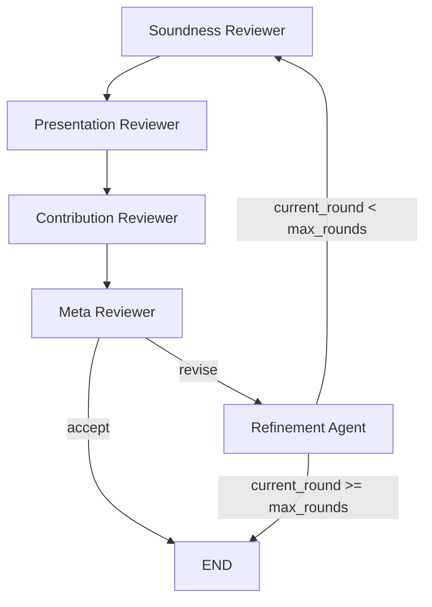

# llm_review

LLM-based multi-agent framework for scientific paper review, with FastAPI backend, simple UI, and BM25 retrieval for file-based runs.

## Version

- Current version: 0.1.0

## Review Graph

The review pipeline uses 5 agents:

1. soundness_reviewer
2. presentation_reviewer
3. contribution_reviewer
4. meta_reviewer
5. refinement_agent

Flow summary:

- Reviewers run in sequence, then meta-reviewer decides.
- If decision is accept -> end.
- Otherwise refinement agent produces revision notes.
- Loop continues until accept or max_iterations is reached.

## API (dev)

All endpoints are under /llm-review.

- GET /llm-review/health
- GET /llm-review/models
- POST /llm-review/test-llm
- GET /llm-review/agents
- POST /llm-review/agents
- GET /llm-review/graph-config
- PUT /llm-review/graph-config
- POST /llm-review/graph-run
- POST /llm-review/graph-run-file

## Run Modes

- Text mode: pass paper text directly to /llm-review/graph-run.
- File mode: pass relative paper path (resource/papers) to /llm-review/graph-run-file, with BM25 retrieval and per-agent query.

## Scripts

All scripts are cross-platform Python. Run them with `uv run python scripts/<name>.py`.

| Script | Command | Description |
|---|---|---|
| start-venv | `uv run python scripts/start-venv.py` | Create `.venv` and install all dependencies |
| run-app | `uv run python scripts/run-app.py` | Sync deps and start uvicorn on port 8080 |
| run-test | `uv run python scripts/run-test.py` | Sync dev deps and run pytest with terminal coverage |
| stop-app | `uv run python scripts/stop-app.py` | Kill the running uvicorn process |
| stop-app (preview) | `uv run python scripts/stop-app.py --preview` | Show which process would be killed |
| clean-cache | `uv run python scripts/clean-cache.py` | Remove `__pycache__`, `.pytest_cache`, `.pyc/.pyo` |
| clean-cache (preview) | `uv run python scripts/clean-cache.py --preview` | Show what would be deleted |
| clean-cache (full) | `uv run python scripts/clean-cache.py --include-venv` | Include `.venv` in cleanup |
