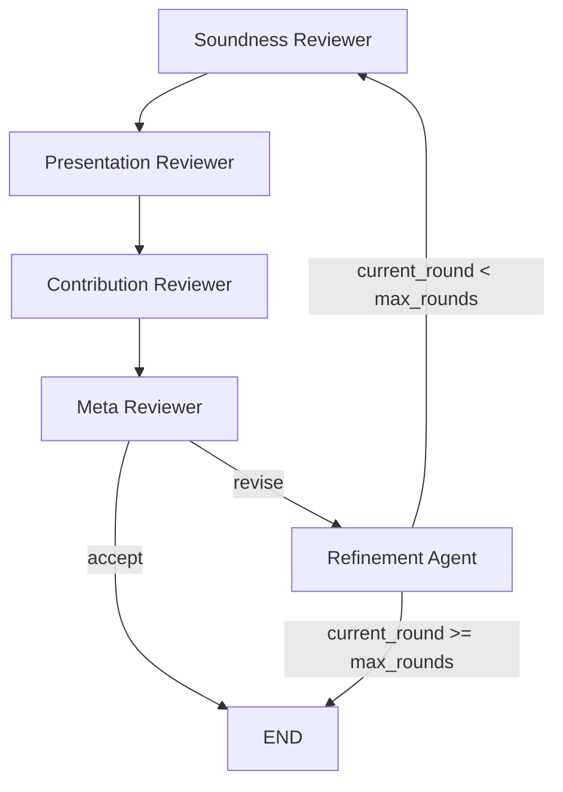

# llm_review

LLM-based multi-agent framework for scientific paper review, with FastAPI backend, simple UI, and BM25 retrieval for file-based runs.

## Version

- Current version: 0.1.0

## Review Graph

The review pipeline uses 5 agents:

1. soundness_reviewer
2. presentation_reviewer
3. contribution_reviewer
4. meta_reviewer
5. refinement_agent

Flow summary:

- Reviewers run in sequence, then meta-reviewer decides.
- If decision is accept -> end.
- Otherwise refinement agent produces revision notes.
- Loop continues until accept or max_iterations is reached.

## API (dev)

All endpoints are under /dev.

- GET /dev/health
- GET /dev/models
- POST /dev/test-llm
- GET /dev/agents
- POST /dev/agents
- GET /dev/graph-config
- PUT /dev/graph-config
- POST /dev/graph-run
- POST /dev/graph-run-file
- GET /dev/openreview/papers/{paper_id}/summary
- POST /dev/openreview/papers/search

## Run Modes

- Text mode: pass paper text directly to /dev/graph-run.
- File mode: pass relative paper path (resource/papers) to /dev/graph-run-file, with BM25 retrieval and per-agent query.

## Tooling

- Run app: ./scripts/run-app.ps1
- Run tests: ./scripts/run-test.ps1
- Stop app: ./scripts/stop-app.ps1
- Clean cache: ./scripts/clean-cache.ps1
