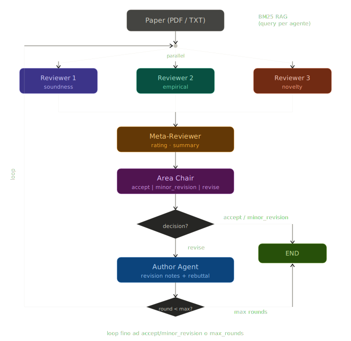

# llm_review

Multi-agent system for automated scientific paper review. It simulates an ML/NLP conference committee: three independent reviewers evaluate the paper in parallel, a meta-reviewer synthesizes the judgments, an area chair makes the accept/revise decision, and an author agent produces revision notes. The loop repeats until acceptance or the maximum number of rounds is reached.

Each agent in the graph is individually configurable with its own LLM model and temperature. The graph itself can be recompiled at runtime with a different agent configuration without restarting the server.

Reviewers also expose persona axes that shape their behavior: **focus** (soundness, empirical, novelty), **commitment** (responsible/irresponsible), **intention** (benign/malicious), and **knowledgeability** (knowledgeable/unknowledgeable). The area chair has a configurable decision style (authoritarian, conformist, inclusive). These parameters allow fine-grained control over review dynamics and simulation of diverse committee compositions.

## Stack

| Layer | Technologies |
|---|---|
| Agent orchestration | LangGraph, LangChain |
| Supported LLMs | Ollama (local), OpenAI, Anthropic |
| Backend | FastAPI, Uvicorn, Pydantic |
| Retrieval | Custom BM25, PyPDF for text extraction |
| Tooling | uv, pytest, pytest-cov |

## Demo static page with real reviews

https://pittalavito.github.io/llm_review/

## Review Graph

6 nodes, 3 reviewers running **in parallel**:

The loop feeds back to the fan-out node, re-launching reviewers in parallel with the author's rebuttal injected into each prompt.

## API

All endpoints under `/llm-review`.

### Graph & Run

| Method | Endpoint | Description |
|---|---|---|
| POST | `/graph/compile` | Compile the graph (optional: per-agent model/temperature config) |
| GET | `/graph/config` | Current graph configuration |
| POST | `/graph/run` | Run the full pipeline on a paper |

### Results

| Method | Endpoint | Description |
|---|---|---|
| GET | `/runs` | List all saved runs |
| GET | `/runs/{run_id}` | Single run detail |
| GET | `/runs/{run_id}/agent-runs` | Agent traces (filter by name/round) |

### Comparison

| Method | Endpoint | Description |
|---|---|---|
| GET | `/compare/papers` | List papers available for comparison |
| GET | `/compare` | Compare pipeline results against reference reviews for a paper |

### Other (dev/test)

| Method | Endpoint | Description |
|---|---|---|
| GET | `/health` | Health check |
| GET | `/models` | List available LLM models |
| POST | `/test-llm` | Direct LLM test |
| GET | `/agents` | List agent names |
| POST | `/agents` | Test a single agent |
| POST | `/agents/prompt-preview` | Preview the built prompt for an agent |
| POST | `/agents/retrieval` | Test agent with RAG |
| GET | `/papers` | List available papers |
| POST | `/papers/index` | Index a paper |
| GET | `/papers/indexed` | List indexed papers |
| GET | `/papers/indexed/detail` | Index detail for a single paper |

## Scripts

All cross-platform Python. Run with `uv run python scripts/<name>.py`.

| Script | Command | Description |
|---|---|---|
| start-venv | `uv run python scripts/start-venv.py` | Create `.venv` and install dependencies |
| run-app | `uv run python scripts/run-app.py` | Start uvicorn on port 8080 |
| run-test | `uv run python scripts/run-test.py` | Run pytest with coverage |
| stop-app | `uv run python scripts/stop-app.py` | Kill the uvicorn process |
| clean-cache | `uv run python scripts/clean-cache.py` | Remove Python cache artifacts |

## Todo / Future work

1. **No DB/FTP integration** — all processed files (RAG index, papers, runs...) live under `resource/`.
2. **No file upload from the UI** — a paper must be manually placed in `resource/papers/` and then indexed by hand.
3. **Naive RAG** — the retrieval is basic and could be improved.
4. **UI improvements** — the UI could be rebuilt with Streamlit.
5. **Prompt versioning** — agent prompts could be versioned and persisted to a DB.
6. **Containerization** — the app could be packaged with Docker.
7. **Custom mock runs** — allow building custom runs reusing real past responses as mocks, but only after storing them in a DB (e.g. Redis).
8. **Compare export** — add a UI function to export the comparison as CSV for use in the thesis.
9. **Dynamic review scope** — let agents set the review scope dynamically (e.g. ICLR, LMN, Other).
